# ADB Proxy

> Use an Android device attached to any machine as if it were plugged into your own.

<p align="center">
  
</p>


## Quick intro

ADB, the Android Debug Bridge, is what allows an Android device to talk to a computer for transferring files, installing apps, debugging, etc.

It consists of several parts, typically:

- An Android device, usually attached to your computer via a USB cable
- An application, like Android Studio or the `adb` CLI
- An ADB server, running on your computer and usually listening on `localhost:5037`, which mediates the communication between devices and applications

While this setup works fine for local development, sometimes I need to access a device somewhere else to test or debug something device-specific.

To address this scenario, ADB-Proxy connects to two ADB servers and bridges them:

- On the local computer, it acts as a local device connected via TCP.
- On the remote server, it acts as an application that communicates with a specific device.

When ADB-Proxy is running, the device appears to be attached to both computers.


## Installation

Requires Python 3.10+. The easiest way is to install with [pipx](https://pipx.pypa.io/) or [uv](https://docs.astral.sh/uv/) from the git sources:

```bash
pipx install 'git+https://github.com/paulo-raca/adb-proxy.git'
# or
uv tool install 'git+https://github.com/paulo-raca/adb-proxy.git'
```

Optional features are gated behind extras: `[devicefarm]` for the AWS DeviceFarm integration and `[upnp]` for the UPnP gateway helper. Pass them as a comma-separated list in brackets:

```bash
pipx install 'git+https://github.com/paulo-raca/adb-proxy.git[devicefarm,upnp]'
# or
uv tool install 'git+https://github.com/paulo-raca/adb-proxy.git[devicefarm,upnp]'
```


## Usage

### Direct connection

The easiest way is to have SSH access to the desired remote machine:

```bash
user@mycomputer$ adbproxy connect -s device_serial -J me@othercomputer
```

This attaches the device identified by `device_serial`, currently attached to `othercomputer`, to the local computer.

### Reverse connection

Sometimes a direct connection isn't possible. In that case, listen on the local computer and start a reverse connection from the remote end:

```bash
user@mycomputer$    adbproxy listen-reverse mycomputer:port     # e.g. 1.2.3.4:5678
user@othercomputer$ adbproxy connect-reverse -s device_serial mycomputer:port
```

#### SSH jumps

If `mycomputer` is not directly reachable from `othercomputer`, you can add SSH jumps (`-J`) along the way:

```bash
# Both computers reach gatewaycomputer over SSH and use it as an intermediary
user@mycomputer$    adbproxy listen-reverse -J user@gatewaycomputer localhost:port
user@othercomputer$ adbproxy connect-reverse -s device_serial -J user@gatewaycomputer localhost:port
```

```bash
# othercomputer can reach mycomputer over SSH
user@mycomputer$    adbproxy listen-reverse mycomputer:port
user@othercomputer$ adbproxy connect-reverse -s device_serial -J user@mycomputer localhost:port
```

```bash
# othercomputer can reach gatewaycomputer directly (gatewaycomputer must be configured with `GatewayPorts yes`)
user@mycomputer$    adbproxy listen-reverse -J user@gatewaycomputer gatewaycomputer:port
user@othercomputer$ adbproxy connect-reverse -s device_serial gatewaycomputer:port
```

#### UPnP gateways

> **Note**
> This section requires the `upnp` extra (`pip install 'git+...adb-proxy.git[upnp]'`).

If you are behind a NAT and your router has UPnP enabled, `--upnp` automatically sets up port forwarding on your gateway from the public internet:

```bash
user@mycomputer$    adbproxy listen-reverse --upnp
user@othercomputer$ adbproxy connect-reverse gateway_ip:gateway_port    # listen-reverse prints the gateway IP and port
```

#### Ngrok

If your computer can't be reached directly (NAT/firewall) and UPnP isn't an option either, fall back to using [ngrok](https://ngrok.com) as a gateway. Create an account and set up your SSH key, then run with `--ngrok`:

```bash
user@mycomputer$    adbproxy listen-reverse --ngrok
user@othercomputer$ adbproxy connect-reverse ngrok_host:ngrok_port      # listen-reverse prints the host and port
```


### AWS DeviceFarm

> **Note**
> This section requires the `devicefarm` extra (`pip install 'git+...adb-proxy.git[devicefarm]'`).

[DeviceFarm](https://aws.amazon.com/device-farm/) is an AWS service for automated testing of Android and iOS apps.

Using reverse connections and a small test spec, you can attach to a device that's currently running a DeviceFarm job. You'll need:

- `~/.aws/config` set up with your access keys (region is hardcoded to `us-west-2`, the only region where DeviceFarm runs)
- A project on DeviceFarm
- Either a device pool **or** one or more specific devices to attach to

Pick devices either by **pool** (`--device-pool`) or by **specific device** (`--device`, repeatable; accepts the model name, ARN, or instance ID — exactly one of the two is required):

```bash
# Run against every device in a named pool
user@mycomputer$ adbproxy devicefarm --project="MyProject" --device-pool="Top Devices"
```

```bash
# Run against one specific device (repeat --device for multiple)
user@mycomputer$ adbproxy devicefarm --project="MyProject" --device="Google Pixel 8"
user@mycomputer$ adbproxy devicefarm --project="MyProject" --device="Google Pixel 8" --device="Samsung Galaxy S24"
```

The connectivity options are the same as those for reverse connections (`--upnp`, `--ngrok`, `-J`):

```bash
adbproxy devicefarm --project="MyProject" --device-pool="Top Devices" --upnp
adbproxy devicefarm --project="MyProject" --device-pool="Top Devices" --ngrok
adbproxy devicefarm --project="MyProject" --device-pool="Top Devices" -J user@gatewaycomputer gateway_ip:port
```


### Hostshell

ADB-Proxy exposes a special command — `shell:hostshell` — that runs a shell on the **proxy machine itself** instead of on the device. Useful for debugging the host where the device lives, running a quick `adb` command in the device's environment, or poking around without opening a separate SSH session.

```bash
# Interactive shell on the proxy host (with [adbproxy] prompt banner)
user@mycomputer$ adb shell hostshell

# One-shot commands
user@mycomputer$ adb shell hostshell ls /tmp
user@mycomputer$ adb shell hostshell uname -a
```

The prompt is prefixed with `[adbproxy]` so you can tell at a glance you're in the proxy's local shell, not on the device.

When tunneled over a real `sshd` (e.g. via `-J`), the prompt env vars are only propagated if `sshd_config` includes:

```
AcceptEnv PS1 PROMPT_COMMAND
```


## Interactive session with `scrcpy`

ADB connections are nice, but an interactive screen you can see and click is essential. [Genymobile's scrcpy](https://github.com/Genymobile/scrcpy) fills that gap.

`scrcpy` has been optimized for low-latency local connections and can feel sluggish when accessing a device thousands of km away. Reducing the screen resolution and bitrate helps a lot — `adbproxy connect` has a convenience `--scrcpy` flag that launches scrcpy with those tuned defaults:

```bash
user@mycomputer$ adbproxy connect -s device_serial -J me@othercomputer --scrcpy
```

Equivalent to running scrcpy with `-b384k -m960`:

- `-b384k`: 384 kbps bitrate (heavily influences image quality)
- `-m960`: resize screen to half its normal size, e.g. 1920 → 960 (heavily influences latency)


## Other options

- `--no-adb-reverse` — disables forwarding of reverse-connection ADB streams (device → host). Use when the device shouldn't be able to open back-channels to your machine.
- `--device-adb-server HOST:PORT` — point at a non-default ADB server on the *device side* (default `localhost:5037`).
- `--host-adb-server HOST:PORT` — same, but for the *host side*.

The bridged device shows up in `adb devices -l` with `product:<name>@<hostname>` so you can distinguish it from a direct USB connection to the same phone.
